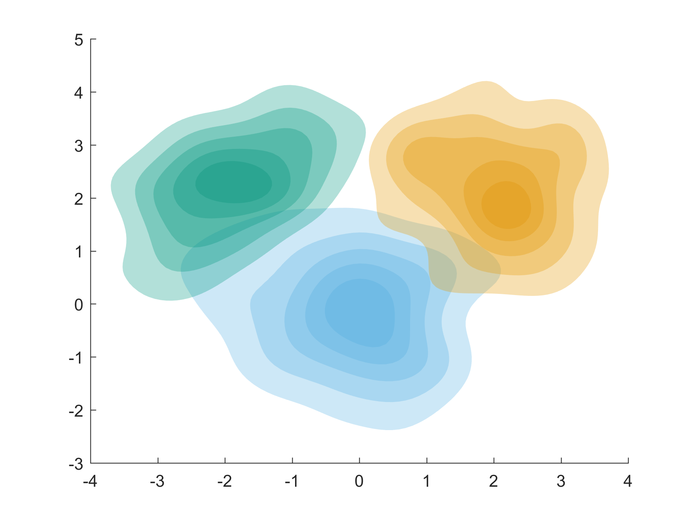
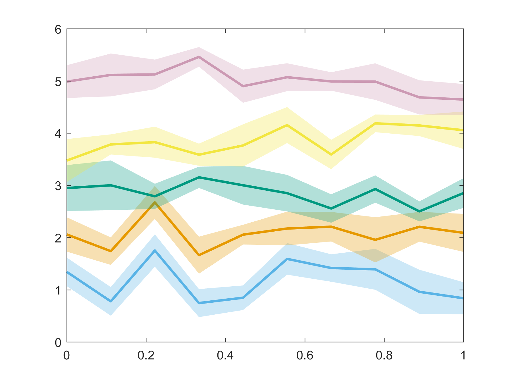

# matlab-uncertainty-viz

Matlab functions for visualizing uncertainty.

```matlab
P1 = mvnrnd([0 0], [1 0;0 1], 100);
P2 = mvnrnd([2 2], [1 0;0 1], 100);
P3 = mvnrnd([-2 2], [1 .7;.7 1], 100);
kscontour({P1, P2, P3});
```




```matlab
 x = linspace(0, 1, 10);
 for iL = 1:5
   y = iL+randn(length(x));
   ploterr(x, y, 'Color', iL)
 end
```



